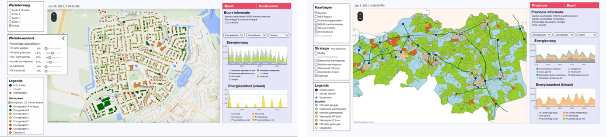

Introduction
==============

Welcome to the full documentation on the Brabant energy system digital twin tool.

The tool has been made as a **digital twin** with elements of a **serious game**, aimed at policy makers. 
The main goal of the game is for policy makers to gain insight into the **system effects, key choices and trade-offs** when
creating sustainability strategies for their neighborhoods. We start by modelling indivdual households in **neighborhoods**
and scale-up to show grid congestion and availability of heat sources on a **provincial** level.

Do you want to get started or link to some further documentation?
This documentation contains details on the user interface, results, calculations and data. See the full documentation :ref:`contents`.
The documentation can be valuable for both users and modellers.

Besides this you can the links underneath to navigate to the source code of both models, and the tool itself.

- Go to the :doc:`user-manual`
- Go to the `tool <https://zenmo.com/brabant-serious-game-energietransitie/>`_
- Go to the `neighborhood model github <https://github.com/ZEnMo/Brabant-buurt-serious-game/>`_
- Go to the `province model github <https://github.com/ZEnMo/Brabant-systeem-integratie-model/>`_

.. _intellectual-property-and-usage:

Intellectual property and usage
--------------------------------

This is an **open-source model** developed by `Zenmo Simulations <https://zenmo.com/>`_ and the `Eindhoven University of Technology <https://tue.nl>`_. 
It was commissioned by the Province of Noord-Brabant and grid operator Enexis. Usage is on your own risk, Zenmo and the TU/e have no liability towards
third parties or other users. For full terms of use see 

The model is aimed at giving insight in key dynamics and trade-offs in energy transition strategies. Do you want to use the model to develop more detailed sustainability strategies or investment decisions, get into contact with us by sending an email to `naud@zenmo.com <mailto:naud@zenmo.com>`_.

.. _license:

License
---------

This is an open-source model which can be used, modified and distributed under GLU 3.0 License, `see license <https://github.com/ZEnMo/Brabant-buurt-serious-game/blob/main/LICENSE>`_ 

.. _contact-and-questions:

Contact and questions
---------------------

The model has been developed by Naud Loomans, PhD. student at the Eindhoven University of Technology and employee at Zenmo Simulations. `Click here <https://research.tue.nl/nl/persons/naud-loomans>`_ 
for an overview of the academic research profile related to this model. For contact or questions read the docs or send an email to `naud@zenmo.com <mailto:naud@zenmo.com>`_.

.. _contents:

Contents
--------

.. toctree::

   user-manual
   neighborhood-model
   province-model
   key-performance-indicators
   data
   working-with-the-models
