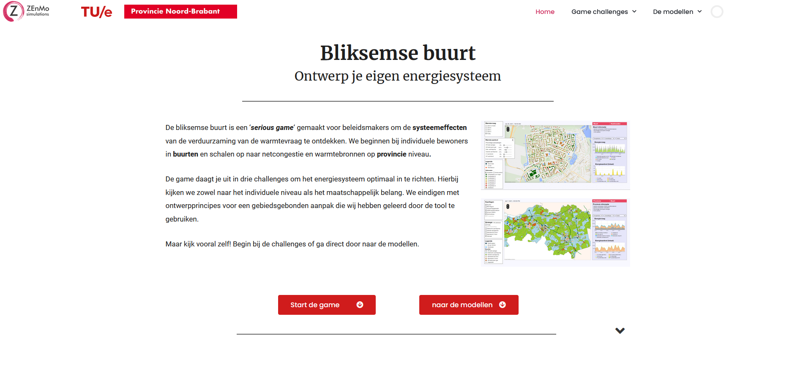
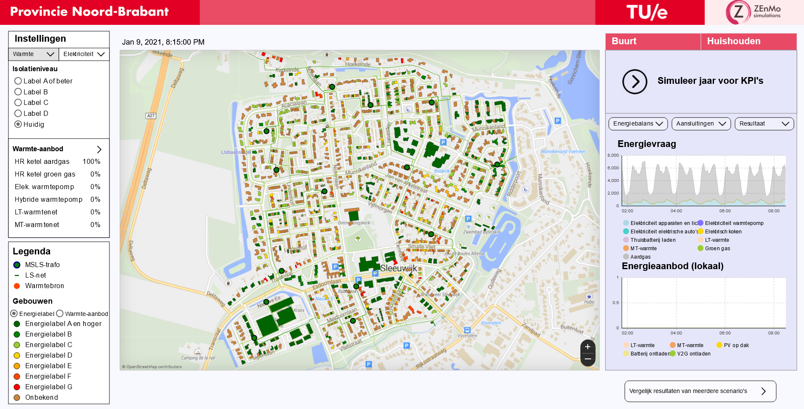

User Manual
============

The user manual contains the full documentation on how the tool can be used and definitions of sliders and settings.
To get better understanding of the results and how they are calculated go to :doc:`key-performance-indicators`.

The serious game starts with a quick explanation of the project and challenges, than continues by explaining the user interface of the
two models, and all interactive buttons the user can use.

.. _tool-homepage:

Tool homepage
--------------

The homepage gives a quick explanation of the goal and perspective of the tool itself and what to expect when playing the challenges.
Users can select to continue the '*game*' playthrough or go directly to the two models. 

.. _user-manual-neighborhood-model:

Neighborhood model
-------------------

The neighborhood model is created to give policy makers insight into the dynamics of sustainability strategies in local energy systems.
The main focus is on modelling the local energy system, connecting households, local collective energy generation and energy grids.
Users can explore the dynamics and trade-offs between different heating solution and run scenarios to compare **individual** versus **collective** heating solutions.
Furthermore, the model is aimed at connecting transitions in heating, electricity, mobility and storage. It is vital to take this integral perspective to show the 
full potential and impact of these transitions on collective resources such as grids, but also on how they can alleviate constraints on these resources by for example smart charging.

For further documentation on the model itself see :doc:`neighborhood-model`.

 
.. _user-manual-neighborhood-information:

Neighborhood information
------------------------

The challenges defined are based on the :doc:`key-performance-indicators`. These have been defined with stakeholders from the Province,
grid operator and municpalities to make sure they allign to user requirements.

The challenges have been set-up in such a way they challenge the user to explore the full range of possiblities and KPIs.
If the user is able to complete the challenges they have gained insight in when grid congestion becomes a critical problem in transition scenarios,
how local flexibility can alleviate this, and how trade-offs in different heating systems lead to different costs but also different levels of congestion.

Three neighborhoods have been modelled. Sleeuwijk west is a typical Dutch village neighborhood, with a fairly distributed building stock in terms of building types
and construction years. Afrikaanderbuurt midden is a typical 60s city neighborhood, with many poorly insulated apartments and terraced houses. Doornbos-Linie is similar to Afrikaanderbuurt midden
a 60s neigbhorhood with poorly insulated appartments and terraced houses. However, unlike Afrikaanderbuurt midden part of the buildings are already heated by a high temperature district heating grid.
See the table and picture underneath for better overview.

.. list-table:: **Neighborhoods**
   :widths: 40 40 40 40
   :header-rows: 1
   
   * - 
     - Sleeuwijk west
     - Afrikaanderbuurt midden
     - Doornbos-Linie
   * - **Municipality**
     - Altena
     - Tilburg
     - Breda
   * - **Inhabitants**
     - 3970
     - 1930
     - 4390     
   * - **Households**
     - 1647
     - 1080
     - 2083
   * - **Current heating solution**
     - Natural gas boilers
     - Natural gas boilers
     - Natural gas boilers + district heating 
   * - **Neighborhood statistics**
     - `Get overview <https://wijkpaspoort.vng.nl/?admin=BU19590201>`_
     - `Get overview <https://wijkpaspoort.vng.nl/?admin=BU08551602>`_
     - `Get overview <https://wijkpaspoort.vng.nl/?admin=BU07580101>`_       

.. image:: images/neighborhood-characteristics.png
  :width: 1000
  :alt: neighborhood-characteristics

.. _user-manual-neighborhood-user-interface:

Neighborhood user interface
----------------------------

.. _neighborhood-model-start-up:

Start-up
~~~~~~~~~

This section describes the user interface of the neighborhood model. To start-up the model click on the **play icon** and wait for the model to get build.
To enhance visibility click on the **full screen mode** icon in the right bottom corner of the simulation screen.

.. _select-neighborhood:

Select neighborhood
~~~~~~~~~~~~~~~~~~~

The first step is selecting your prefered neighborhood. You can select a neighborhood by clicking on the neighborhood image, title or text.
When you have selected the neighborhood click on **'Start buurt simulatie'** for the model to build-up the neighborhood and start the simulation.

.. _home-screen:

Home screen
~~~~~~~~~~~~

The home screen during simulation consists of multiple sections.

#. The **top left** corner is aimed at :ref:`input-settings`. Here you can change the neighborhood heating and electricity strategies.
#. The **bottom left** corner is the **legenda**. This shows what the colors in the buildings represent
#. The **center** part of the screen contains the **digital representation of the neighborhood** with all buildings, grids (in green) and low-voltage transformers (green circels with black lines). Above the map you can see the current date. As the model is in continuous simulation the energy consumption depends on the model date.
#. The **right** part of the screen is for simulation :ref:`results`. It also contains a button to go to the scenario comparison screen.

.. _input-settings:

Input settings
~~~~~~~~~~~~~~~

Input settings can be changed by using the buttons and sliders in the top right corner of the screen. A full description of input settings can be found in the table :ref:`Input settings` underneath.
The user can click on the buttons to change between heating and electricity solutions, and needs to unfold the heating supply and electricity sliders by clicking on the arrow.

.. list-table:: **Input settings**
   :widths: 40 40 100
   :header-rows: 1
   
   * - Setting
     - Range
     - Description
   * - **Heating demand**
     - 
     - 
   * - Insulation level
     - E-A
     - Sets insulation level to a minimum requirement (e.g. setting at C means all households below C would get insulation measures until level C)  
   * - **Heating supply**
     -
     -
   * - Natural gas boilers
     - 0 - # of households
     - Households with a natural gas boiler
   * - Green gas boilers
     - 0 - # of households
     - Households with a green gas boiler
   * - Electric heat pump
     - 0 - # of households
     - Households with an electric heat pump
   * - Hyrbid heat pump
     - 0 - # of households
     - Households with a hyrbid heat pump
   * - Low-temperature district heating
     - 0 - # of households
     - Households connected to a low-temp district heating grid     
   * - Medium-temperature district heating
     - 0 - # of households
     - Households connected to a medium-temp district heating grid
   * - **Electric appliances**
     - 
     -     
   * - Rooftop PV
     - 0 - # of households with PV potential
     - Households with rooftop PV
   * - Induction cooking stove
     - 0 - # of households
     - Households with induction cooking stove
   * - Electric vehicle
     - 0 - # of cars
     - Number of electric vehicles
   * - Home battery
     - 0 - # of households
     - Households with a home battery system
   * - Charging strategy
     - Conventional – smart - bidirectional
     - Charging strategy that all households with an electric vehicle abide
   * - Energy cost assumptions
     - 2022 – 2022 – 2030
     - Assumptions on energy costs (electricity, natural gas, heat, fuels)*

*note: energy cost settings can only be found in the scenario comparison screen. Furthermore they only include energy costs, no changes in investment costs have been assumed*

.. _results:

Results
~~~~~~~~

Results are presented when clicking the 'resultaat' button or when comparing multiple scenarios in the 'vergelijk resultaten van meerdere scenario's' button.
The resultaat screen presents results on a neighborhood level and on a househood level. The househood results are simply neighborhood results divided by the number of households in the neighborhood.
For more information on the exact values see :doc:`key-performance-indicators`.